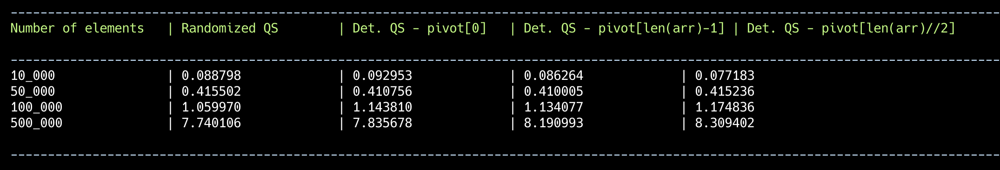
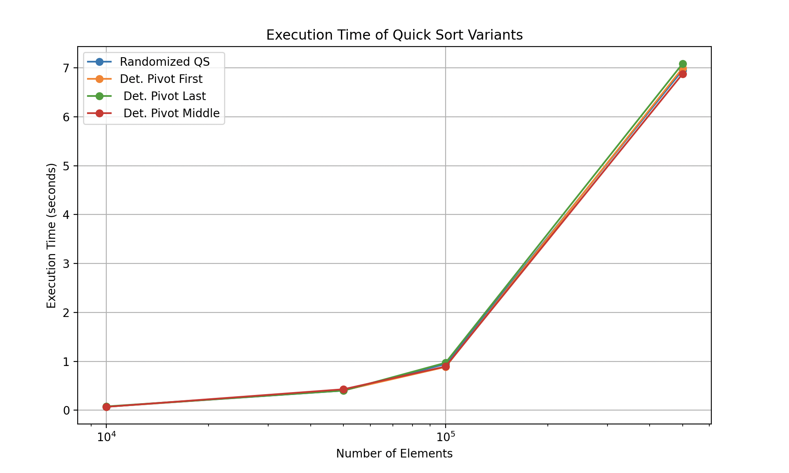
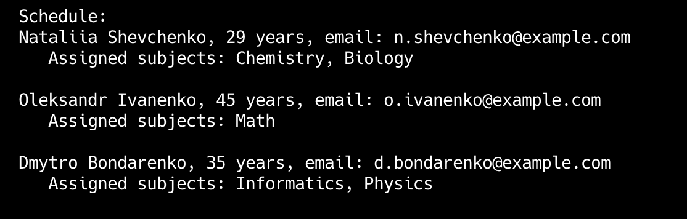

# goit-algo2-hw-10

Design and Analysis of Algorithms: Investigated the QuickSort algorithm, comparing its deterministic and randomized implementations. Additionally, applied greedy algorithms to solve optimization problems, analyzing their efficiency and effectiveness.

# Task 1

This task compares the execution time of randomized and deterministic QuickSort algorithms. The results indicate that both implementations perform similarly, demonstrating equal efficiency.

# Task 2

The result of a greedy method for the schedule composition:

